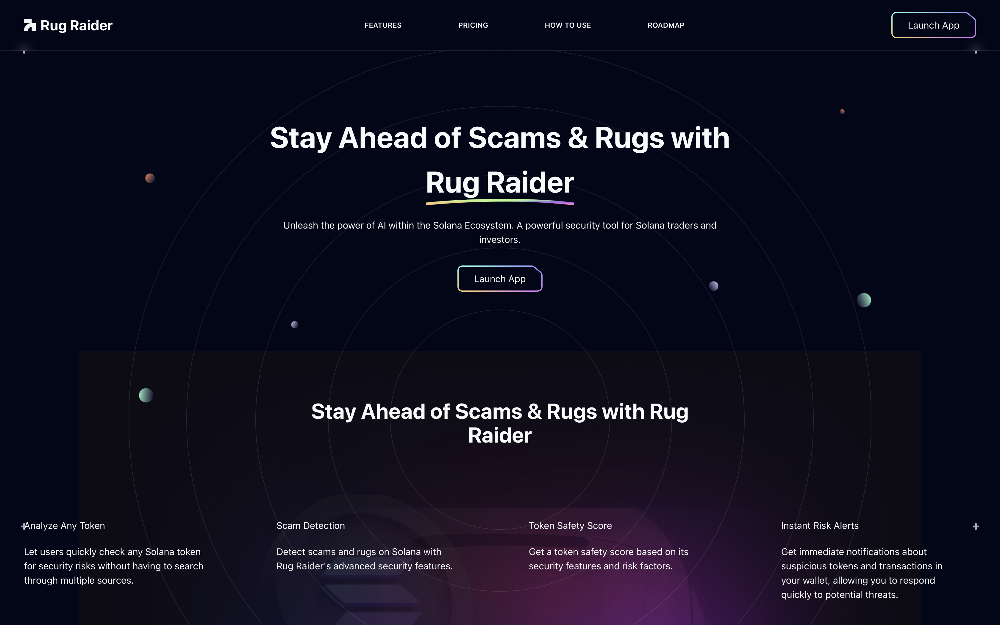

# 🛡️ Rug Raider – Token Risk Detection Dashboard

Rug Raider is a **token risk intelligence dashboard** built with Next.js that helps users identify and assess **potentially malicious or high-risk tokens**. It visualizes risk scores, token metadata, wallet exposure, and alerts based on integrated heuristics and security signals.

> Built for the RugCheck bounty – empowering users to avoid scams before it's too late.

---

## 🚀 Features

- 🔎 **Wallet Token Scanner**: Detects all tokens held in a given wallet and classifies them by risk (Low, Medium, High).
- 🧠 **Token Analysis Panel**: Shows detailed risk score, ownership concentration, supply, and creation metadata.
- 🛡️ **Wallet Security Alert**: Flags wallets with suspicious token exposure.
- 🔔 **Real-Time Risk Alerts** *(Planned)*: Notifies users of token movements or liquidity events in their wallet.
- 🌐 **Support for Solana** *(Modular backend-ready)*

---

## 🧰 Tech Stack

- **Frontend**: [Next.js 14](https://nextjs.org), [Tailwind CSS](https://tailwindcss.com)
- **Design System**: Dark mode dashboard UI with custom risk visualizations
- **Data**: Integrated with  RugCheck API, Solana RPC endpoints
- **Deployment**: Vercel-ready for production

---

## 🧪 Getting Started

Clone the project and install dependencies:

\`\`\`bash
git clone https://github.com/yourusername/rug-raider.git
cd rug-raider
npm install
\`\`\`

Run the development server:

\`\`\`bash
npm run dev
# or
yarn dev
\`\`\`

Open your browser at [http://localhost:3000](http://localhost:3000) to start exploring the app.

---

## 🧠 Future Roadmap

- RugCheck API integration (live token risk scores)
- Wallet connection (Solana wallets)
- Insider detection using wallet network graph
- Upcoming Feature Twitter bot for token risk replies
- Upcoming Rug Raider Extension to intercept transactions 
- Upcoming Liquidity and transaction alerts

---

## 📄 License

This project is open source and available under the [MIT License](LICENSE).

---

## 🙌 Acknowledgments

- [RugCheck.xyz](https://rugcheck.xyz) — for inspiring this project and providing the API ecosystem
- [Next.js](https://nextjs.org) — for powering the frontend
- [shadcn/ui](https://ui.shadcn.com) — for clean, accessible components
